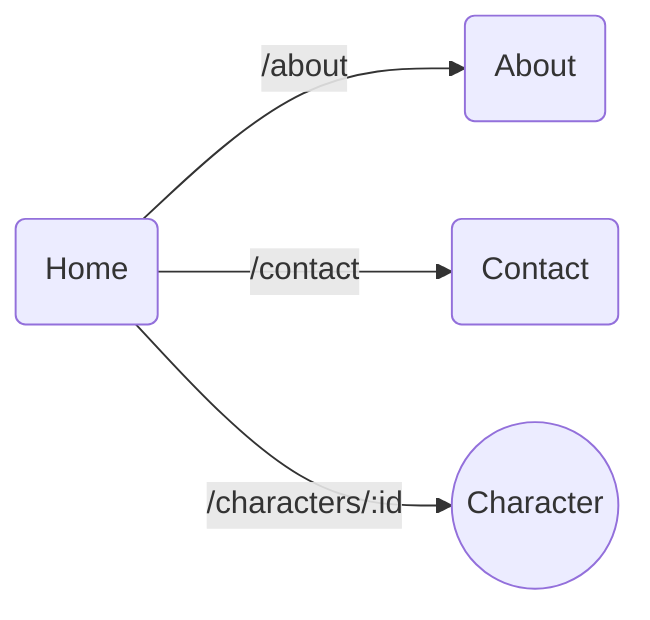

[](https://github.com/AliixScoarnec/Marvel_App/actions/workflows/unit-tests.yml)

[](https://sonarcloud.io/summary/new_code?id=AliixScoarnec_Marvel_App)
[](https://sonarcloud.io/summary/new_code?id=AliixScoarnec_Marvel_App)

# **Marvel App**

## **Installation**

Récupérer le projet en local et installer les dépendances
```
git clone url-du-projet
cd marvel-app
npm install
```

## **Lancement**
```
npm start
```


L'application est accessible à l'adresse http://localhost:3000


## **Test**
Execution des tests unitaires en mode watch, c'est à dire que les tests sont relancés à chaque modification de code.

```
npm test
```
Execution des tests uniquement une fois avec le rapport détaillé de la couverture du code

```
npm run test:coverage
```

## Conception
Le projet est composé de 4 pages :
* Home (page d'accueil): Liste des personnages
* Character : Page de détail d'un personnage
* About : Page d'information sur l'application
* Contact : Page de contact




